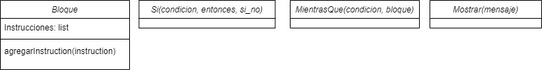
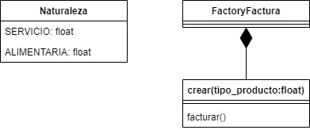

# Ejercicios_EstructurasDatos
<h1 align="center">Ejercicios de Estructuras de Datos</h1>

En este [repositorio](https://github.com/Xavitheforce/Ejercicios_EstructurasDatos) quedan resuletos los diversos ejercicios propuestos.

## Índice
1. [Ejercicio 1](#id1)
3. [Ejercicio 2](#id2)
3. [Ejercicio 3](#id3)
***

## Ejercicio 1<a name="id1"></a>

En este ejercicio he creado una función(en el mismo fichero para no abrir uno nuevo sin sentido) que recorre el programa propuesto(la construcción de un bucle while).

El código empleado para resolverlo es el siguiente:

```python
class Bloque: 
    # Un bloque es un conjunto de instrucciones ejecutadas 
    # unas detrás de otras. 
    def __init__(self): 
        # Por defecto, un bloque no contiene ninguna instrucción. 
        self.instrucciones = [] 
 
    def agregarInstruction(self, instruccion): 
        self.instrucciones.append(instruccion) 
 
class Si: 
    # Representa una instrucción 'if'. 'condicion' es una cadena 
    # de caracteres que contiene la evaluación de la condición, 
    # 'entonces' es el bloque de instrucciones ejecutadas si la condición 
    # se verifica, 'si_no' es el bloque de instrucciones ejecutadas 
    # si no se verifica. 
 
    def __init__(self, condicion, entonces, si_no): 
        self.condicion = condicion 
        self.entonces = entonces 
        self.si_no = si_no 
 
class MientrasQue: 
    # Representa una instrucción 'while'. 
    # 'condicion' es una cadena que contiene el valor evaluado 
    # para decidir si el bucle continúa o no, 
    # 'bloque' es la secuencia de instrucciones ejecutadas en bucle. 
    def __init__(self, condicion, bloque): 
        self.condicion = condicion 
        self.bloque = bloque 
 
class Mostrar: 
    # Una instrucción para mostrar un mensaje 
    # en salida estándar. 
    def __init__(self, mensaje): 
        self.mensaje = mensaje

mostrar_ok = Mostrar('"OK"') 
mostrar_ko = Mostrar('"KO"') 
alternativa = Si(2 + 2 == 4, mostrar_ok, mostrar_ko) 
bloque_alternativa = Bloque() 
bloque_alternativa.agregarInstruction(alternativa) 
bucle = MientrasQue(True, bloque_alternativa)

#programa visitante(para no tener que abrir un archivo nuevo):
def visitante():
    while bucle.condicion:
        bloqueif = bloque_alternativa.instrucciones[0]
        if bloqueif.condicion:
            print(bloqueif.entonces.mensaje)
        else:
            print(bloqueif.si_no.mensaje)
        break #el bucleo sería infinto y la terminal acabaría bloqueada de no meter este break.
```
El UML es el siguiente:

<br>

<br>

## Ejercicio 2<a name="id2"></a>

En este ejercicio he creado una función que recoge un texto escrito por el usuario(lo que sería la entrada estándar) con sus atributos principales encapsulados. La función separa el texto introducido en caracteres y recoge y almacena en un documento txt las dos primeras líneas(se asume que una línea son 100 caracteres).


El código empleado para resolverlo es el siguiente:
 
 ```python
from introducir.cadena import solicitar_introducir_cadena

def doslineas():
    archivo = open("Mayúsculas.txt", 'w', encoding='utf-8')
    archivo.write("")
    archivo.close()
    __texto = solicitar_introducir_cadena("Introduce un texto") #entrada éstandar. Digamos que una línea vale 100 caracteres.
    __caracteres = list(__texto)
    archivo = open("Mayúsculas.txt", 'a', encoding='utf-8')
    for j in range(2):
        if len(__caracteres) < 101:
            archivo.write(str(__texto))
            break
        else:
            for i in range(100):
                letra = __caracteres[i]
                if i == 99:
                    archivo.write(str(letra)+"\n")
                else:
                    archivo.write(letra)
            for k in range(100):
                __caracteres.pop(0) 
    archivo.close()
```

## Ejercicio 3<a name="id3"></a>

El código está planteado para que funcione EXACTAMENTE como el ejercicio propone, sin modificación alguna.

El código empleado para resolverlo es el siguiente:
 
 ```python
 #producto = Producto(Naturaleza.ALIMENTARIA) # IVA 5,5% 
#precio_neto = FactoryFactura.crear(producto).facturar() 
#print(precio_neto) 
## 105.5 
 
#producto = Producto(Naturaleza.SERVICIO) # IVA 20% 
#precio_neto = FactoryFactura.crear(producto).facturar() ==> int
#print(precio_neto) 
## 120

class Naturaleza:
    SERVICIO = 0.2
    ALIMENTARIA = 0.055
class FactoryFactura:
    class crear():
        def __init__(self, tipo_producto):
            self.tipo_producto = tipo_producto
        def facturar(self):
            if self.tipo_producto == 0.2 or 0.05:
                self.precio = 100
                return self.precio+(self.precio*self.tipo_producto)
            else:
                print("El programa solo factura productos alimentarios o servicios.")
def Producto(iva):
    return iva

producto = Producto(Naturaleza.ALIMENTARIA)
precio_neto = FactoryFactura.crear(producto).facturar()
print(precio_neto)

producto = Producto(Naturaleza.SERVICIO)
precio_neto = FactoryFactura.crear(producto).facturar()
print(precio_neto)

```
El UML es el siguiente:

<br>

<br>
